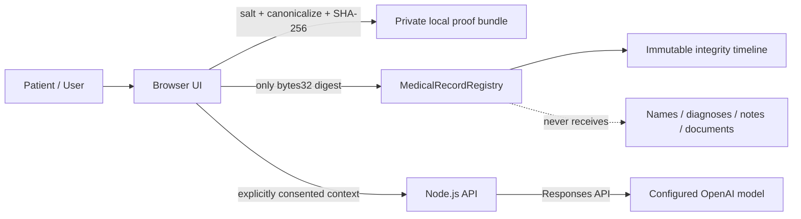

# AI Healthcare Decision Support - HealthChain v2

> Security-first research prototype for **medical-record integrity proofs + patient-controlled blockchain authorization + AI-assisted clinical education**.

[](https://github.com/emreocell/ai-healthcare-decision-support/actions/workflows/ci.yml)


This repository is a full modernization of my Computer Engineering graduation-project prototype. The original idea combined blockchain-backed medical records with AI support. Version 2 keeps the research intent but changes the architecture around a stricter principle:

**A public blockchain may prove integrity; it must not become a database for private medical content.**

The result is a compact end-to-end system with a Solidity registry, a browser client, a Node.js API, explicit AI privacy consent, tests, CI, and a documented threat model.

> [!CAUTION]
> This project is **not** a medical device, diagnostic system, treatment service, electronic health record product, or compliance package. Do not use it for real clinical decisions or store real patient information in the demo.

## What changed from the thesis prototype?

The original public prototype stored names and conditions directly in a smart contract, exposed mutable "admin" operations without access control, committed generated dependency folders, used a hardcoded contract address, and contained an AI API credential in source code. The v2 design replaces those patterns with explicit security boundaries and an auditable project structure.

See [`docs/MODERNIZATION.md`](docs/MODERNIZATION.md) for the detailed change list.

## Architecture



### Trust boundaries

- **On-chain:** salted data digest, hashed record category, author wallet, timestamp, revocation status.
- **Off-chain/local:** clinical note, random salt, proof bundle.
- **Optional AI request:** only the context the user explicitly enters and consents to send.
- **Not included:** production database, hospital identity system, encrypted object storage, FHIR server, or compliance layer.

The separation is intentional. Read the full [`architecture`](docs/ARCHITECTURE.md) and [`threat model`](docs/THREAT_MODEL.md).

## Key features

### Blockchain integrity registry

- Patient-owned provider write authorization.
- Append-only record anchoring.
- Salted `SHA-256` content digests instead of plaintext medical records.
- Hashed record categories instead of readable diagnosis/category strings.
- Patient-only revocation markers.
- Duplicate digest prevention per patient.
- Contract events suitable for an audit trail.
- No global patient enumeration function.

### Private proof bundle

The browser creates a random 32-byte salt and hashes the local payload before sending anything to the contract. After anchoring, the user can download a local JSON proof bundle containing the payload, salt, digest, contract address, chain ID, and transaction hash.

The proof bundle is intentionally excluded by `.gitignore` because it may contain sensitive information.

### AI-assisted clinical education

The optional API endpoint uses the OpenAI Responses API with a configurable model. The default is `gpt-5.6-terra`, while `OPENAI_MODEL` keeps model selection outside source code.

The endpoint is deliberately constrained:

- explicit AI-data consent is required;
- input size and list lengths are bounded;
- request bodies are not logged;
- responses are marked `no-store`;
- output instructions prohibit diagnosis, prescription, dosing, and medication changes;
- the output is framed as questions and educational notes for discussion with a licensed clinician.

This is still an AI model and can be wrong.

## Repository structure

```text
.
├── .github/
│   ├── dependabot.yml
│   └── workflows/ci.yml
├── apps/
│   ├── api/
│   │   ├── src/
│   │   │   ├── app.js
│   │   │   ├── clinicalEducation.js
│   │   │   ├── config.js
│   │   │   ├── server.js
│   │   │   └── validation.js
│   │   └── test/
│   │       └── validation.test.js
│   └── web/
│       ├── assets/
│       │   ├── app.js
│       │   ├── contract-abi.js
│       │   ├── deployment.json
│       │   └── styles.css
│       └── index.html
├── contracts/
│   └── MedicalRecordRegistry.sol
├── docs/
│   ├── ARCHITECTURE.md
│   ├── MODERNIZATION.md
│   └── THREAT_MODEL.md
├── scripts/
│   └── deploy.js
├── test/
│   └── MedicalRecordRegistry.test.js
├── .env.example
├── .gitignore
├── CONTRIBUTING.md
├── SECURITY.md
├── hardhat.config.js
├── package-lock.json
└── package.json
```

## Quick start

### Requirements

- Node.js 20+
- npm
- MetaMask or another EIP-1193 compatible browser wallet

### 1. Install dependencies

```bash
npm ci
```

### 2. Configure the optional AI feature

```bash
cp .env.example .env
```

Add an API key to `.env` only if you want to use the AI section:

```env
OPENAI_API_KEY=your_key_here
OPENAI_MODEL=gpt-5.6-terra
```

Never commit `.env`.

### 3. Start the local blockchain

```bash
npm run chain
```

Hardhat exposes the local network at `http://127.0.0.1:8545` with chain ID `31337`.

### 4. Deploy the registry

In a second terminal:

```bash
npm run deploy:local
```

The deploy script writes the contract address and chain ID to `apps/web/assets/deployment.json`; there is no address to copy into source code.

### 5. Start the web/API server

```bash
npm start
```

Open `http://localhost:5000`, connect a wallet configured for the local Hardhat network, and use one of Hardhat's local development accounts.

## Tests and checks

```bash
npm run check
npm run test:api
npm run test:contracts
```

`npm test` runs both API and smart-contract test suites. GitHub Actions repeats syntax checks and tests on pull requests and pushes to `main`.

## Security design

The strongest change in v2 is not a framework choice; it is the data model.

### Never store plaintext medical data on a public chain

The original prototype stored a patient's name and condition strings directly in contract storage. Public blockchain state is visible and difficult to erase. Version 2 stores only a salted digest and non-readable type hash.

### Authorization is for writes, not privacy

A patient may authorize a provider wallet to append proofs. Anyone who can inspect the chain can still inspect public metadata. Provider authorization must never be described as record confidentiality.

### No mutable medical-history "admin"

The original contract exposed update/delete style functions without access control. Version 2 is append-only: content hashes are not edited. A patient can mark an entry revoked while the original integrity event remains auditable.

### Secrets belong in the environment

The runtime reads `OPENAI_API_KEY` from `.env`/environment variables. The repository tracks only `.env.example`.

**Important:** an API credential existed in the historical public source. That historical credential must be considered compromised and revoked at the provider even after current code is fixed.

More: [`SECURITY.md`](SECURITY.md)

## Thesis / academic origin

This repository evolved from my Fırat University Computer Engineering graduation thesis and its implementation prototype.

- Graduation thesis PDF: <https://emreocell.github.io/assets/tez.pdf>
- Portfolio: <https://emreocell.github.io>

The v2 codebase is a modernization of the implementation, not a claim that the original thesis experiments or conclusions have been re-run under the new architecture.

## Limitations

- No production encrypted health-record database is included.
- No FHIR/HL7 integration is implemented.
- Wallet addresses are pseudonymous, not anonymous.
- Blockchain metadata remains public.
- Smart contracts have not undergone a professional third-party audit or formal verification.
- The in-memory API rate limiter is not suitable for horizontally scaled production deployments.
- AI output is not clinically validated and must not be used to make care decisions.
- This repository does not claim HIPAA, GDPR, KVKK, medical-device, or hospital-system compliance.

## Roadmap

- Encrypted off-chain storage adapter with envelope encryption.
- FHIR-compatible resource mapping without placing FHIR payloads on-chain.
- Signed provider attestations and institution identity layer.
- Formal smart-contract property tests / fuzzing.
- Privacy-preserving proof experiments for selective disclosure.
- End-to-end browser tests against a local Hardhat node.
- Reproducible research fixtures using synthetic, non-patient data only.

## License

MIT License - see [`LICENSE`](LICENSE).

---

Built by **Emre Öcel** as an engineering-focused evolution of the original graduation-project prototype.
