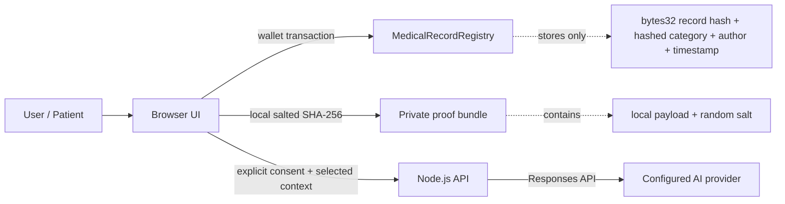

# Architecture

## System boundary

HealthChain Decision Support separates three concerns that should not be conflated:

1. **Integrity** - a public blockchain records a salted digest proving that a specific off-chain payload existed in a particular form.
2. **Confidentiality** - clinical content remains off-chain. This repository does not ship a production medical-data store.
3. **Decision support** - an optional server endpoint sends explicitly consented, non-identifying context to an AI provider for educational output.



## Smart contract

`contracts/MedicalRecordRegistry.sol` is intentionally narrow. It provides:

- patient-owned provider write authorization;
- append-only integrity proofs;
- patient-controlled revocation markers;
- duplicate digest prevention per patient;
- events for auditability;
- no patient enumeration and no plaintext clinical fields.

Authorization controls **who may write** a patient's record hash. It does not make Ethereum/Hardhat storage private. Public-chain readers can still inspect every value stored on-chain.

## Salted integrity proof

Hashing a short diagnosis or name directly is unsafe because low-entropy values can be guessed. The browser therefore generates a random 32-byte salt and computes:

```text
SHA-256( salt_hex + ":" + canonical_json_payload )
```

Only the digest is anchored. The salt and original payload remain in an optional local proof bundle. Losing the proof bundle does not expose the on-chain hash, but it prevents later reconstruction/verification of that local payload.

## API

The API:

- requires explicit AI-processing consent in the request;
- validates and bounds array/string inputs;
- does not log request bodies;
- limits request body size;
- applies a simple in-memory rate limit;
- uses an origin allowlist;
- returns `Cache-Control: no-store` for health-related responses;
- keeps the model configurable through environment variables.

For horizontally scaled production services, replace the in-memory rate limiter with a shared store and perform a formal privacy/security review.
