# Architecture

## System boundary

HealthChain Decision Support separates three concerns that should not be conflated:

1. **Integrity** — a public blockchain records one salted digest proving that a specific off-chain payload existed in a particular form.
2. **Confidentiality** — clinical content and record categories remain off-chain. This repository does not ship a production medical-data store.
3. **Decision support** — an optional server endpoint sends explicitly consented, non-identifying context to an AI provider for educational output.

```mermaid
flowchart LR
  U[User / Patient] --> W[Browser UI]
  W -->|wallet transaction| C[MedicalRecordRegistry]
  W -->|local salted SHA-256| P[Private proof bundle]
  W -->|explicit consent + selected context| A[Node.js API]
  A -->|Responses API| O[Configured AI provider]

  C -. stores only .-> H[bytes32 salted digest + author + timestamp + revocation marker]
  P -. contains .-> D[local payload + random salt]
```



## Smart contract

`contracts/MedicalRecordRegistry.sol` is intentionally narrow. It provides:

- patient-owned provider write authorization;
- append-only integrity proofs;
- patient-controlled revocation markers;
- duplicate digest prevention per patient;
- events for auditability;
- no patient enumeration and no plaintext clinical fields or categories.

Authorization controls **who may write** a patient's proof. It does not make Ethereum/Hardhat storage private. Public-chain readers can still inspect wallet relationships, timestamps, hashes, and transaction metadata.

## Salted integrity proof

Hashing a short diagnosis, record type, or name directly is unsafe because low-entropy values can be guessed. HealthChain therefore does not publish a separate hash of those fields.

The browser generates a random 32-byte salt and computes one commitment over the complete canonical local payload:

```text
SHA-256( salt_hex + ":" + canonical_json_payload )
```

The record category is part of that private payload, so it is committed by the same salted digest without becoming a separately guessable on-chain value.

Only the digest is anchored. The salt and original payload remain in an optional local proof bundle. Losing the bundle does not expose the on-chain digest, but it prevents later reconstruction/verification of that local payload.

## API

The API:

- requires explicit AI-processing consent in the request;
- validates and bounds array/string inputs;
- does not log request bodies;
- limits request body size;
- applies an in-memory rate limit with stale-bucket cleanup;
- uses an origin allowlist;
- sends defensive browser security headers;
- returns `Cache-Control: no-store` for health-related responses;
- keeps model selection configurable through environment variables.

For horizontally scaled production services, replace the in-memory rate limiter with a shared store and perform a formal privacy/security review.
